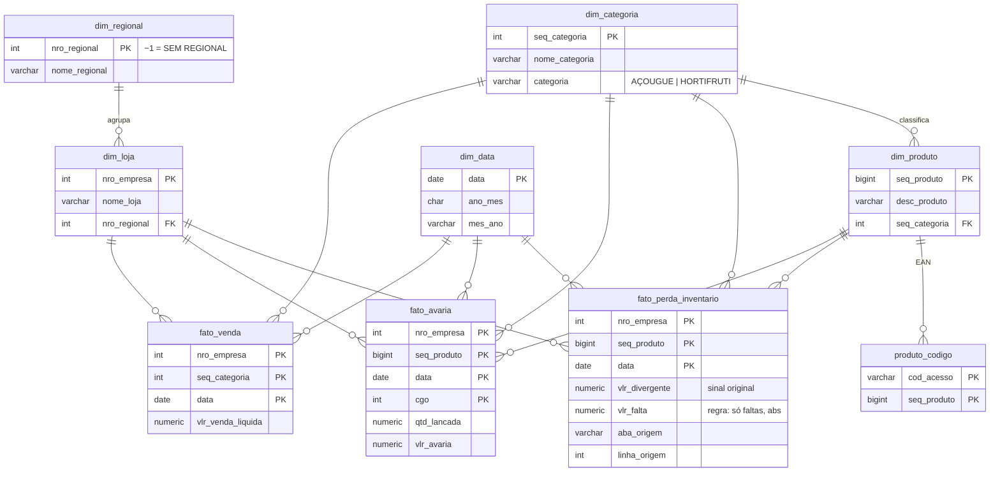
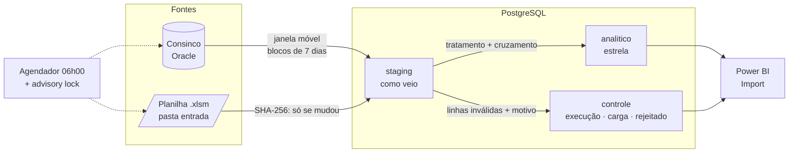

# Modelo de dados

```mermaid
erDiagram
    dim_regional ||--o{ dim_loja : "agrupa"
    dim_loja ||--o{ fato_venda : ""
    dim_loja ||--o{ fato_avaria : ""
    dim_loja ||--o{ fato_perda_inventario : ""
    dim_categoria ||--o{ fato_venda : ""
    dim_categoria ||--o{ fato_avaria : ""
    dim_categoria ||--o{ fato_perda_inventario : ""
    dim_categoria ||--o{ dim_produto : "classifica"
    dim_produto ||--o{ fato_avaria : ""
    dim_produto ||--o{ fato_perda_inventario : ""
    dim_produto ||--o{ produto_codigo : "EAN"
    dim_data ||--o{ fato_venda : ""
    dim_data ||--o{ fato_avaria : ""
    dim_data ||--o{ fato_perda_inventario : ""

    dim_regional { int nro_regional PK "−1 = SEM REGIONAL"
                   varchar nome_regional }
    dim_loja { int nro_empresa PK
               varchar nome_loja
               int nro_regional FK }
    dim_categoria { int seq_categoria PK
                    varchar nome_categoria
                    varchar categoria "AÇOUGUE | HORTIFRUTI" }
    dim_produto { bigint seq_produto PK
                  varchar desc_produto
                  int seq_categoria FK }
    produto_codigo { varchar cod_acesso PK
                     bigint seq_produto PK }
    dim_data { date data PK
               char ano_mes
               varchar mes_ano }
    fato_venda { int nro_empresa PK
                 int seq_categoria PK
                 date data PK
                 numeric vlr_venda_liquida }
    fato_avaria { int nro_empresa PK
                  bigint seq_produto PK
                  date data PK
                  int cgo PK
                  numeric qtd_lancada
                  numeric vlr_avaria }
    fato_perda_inventario { int nro_empresa PK
                            bigint seq_produto PK
                            date data PK
                            numeric vlr_divergente "sinal original"
                            numeric vlr_falta "regra: só faltas, abs"
                            varchar aba_origem
                            int linha_origem }
```

```mermaid
flowchart LR
    subgraph Fontes
      A[(Consinco<br/>Oracle)]
      B[/Planilha .xlsm<br/>pasta entrada/]
    end
    subgraph PostgreSQL
      S[staging<br/>como veio]
      D[analitico<br/>estrela]
      C[controle<br/>execução · carga · rejeitado]
    end
    A -- "janela móvel<br/>blocos de 7 dias" --> S
    B -- "SHA-256: só se mudou" --> S
    S -- "tratamento + cruzamento" --> D
    S -- "linhas inválidas + motivo" --> C
    D --> P[Power BI<br/>Import]
    C --> P
    T[Agendador 06h00<br/>+ advisory lock] -.-> A & B
```
